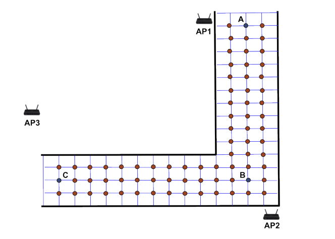
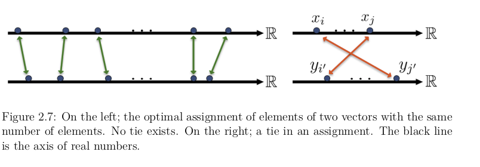
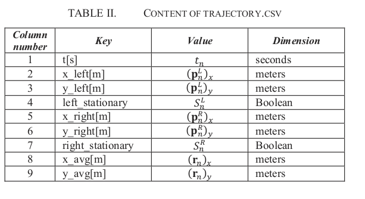

2) Many problems accept discretization. Not all of them.

from l02 planning

// .Optional title
[example]
we apply the discretisation to our problem, and transform the global search task, to local graph search problem. The problem becomes much similar to HMC solutions and realisations.

The objective is to find a feasible solution to slam and planning problems.
Why does the term feasible is applied here? We have to first define, what is infeasible solution, and which system is inappropriate for usage.

Considering the probabilistic approach, once we have some uncertaity in data, we need a way to reduce this uncertainty. So, the only requirement for the system, is that the covariance in localization problem can be decreased.

In our implementation, we perform integration of IMU data. The uncertainty increases quadratically.

// our method
After a series of integration steps, we have a new pose. The uncertainty can be decreased only after adding new information on human or location. The information we have are sensor measurements, building map, IMU data.
For the extension of current aproach we may consider pose prediction methods, special approach of human step detection and different sesnor fusion models.
Here we don't consider this refinements and focus on localization and mapping method only for a given sensor model.

// We want to estimate, how spatial magnetic field data can be utilized without signal of other sensors. We know that
The dead-reckoning is the localization or pose update when the sensor data are not available. In common indoor localization sistem , as in []
traditional sensors are []
we model the localization with loosy signal connection of WiFi and BLE, we estimate how the spatial data of magnetic field and IMU PDR can increase the localization accuracy.
// TODO: need an experimant here

Given the proof that the spatial information of magnetic field has a significant effect for traditional PDR, we focus on this technology.

We have examples of products that are based mostly on magnetic field
// list products and papers

There is no information of how the magnetic data can be collected in absence of precise location. We searched for a possible solutions to this task.

First, the task is to find a precise location which is usually called ground truth for training the system, creating the map of the location, for estimatimation of the algorithm performance.

== update on pre-defence

explain why magn field / where needed to apply: perception tool.
in analogy of how a blind human can interact in space without vision,
this solution is a complementary sensory source of information.

draw results of experiments

 representing the idea of some

 it is guaranteed to be found

solution, and

=== update 15.04

MATHEMATICAL NOTATION OF AVAILABLE MEASUREMENTS IN WIRELESS
COMMUNICATION SYSTEMS TOGETHER WITH APPROXIMATIVE NOISE STANDARD
DEVIATIONS σ e . [HERE y IS THE ACTUAL NUMERICAL VALUE, h DENOTES A GENERAL
NONLINEAR MODEL, p t IS THE SOUGHT POSITION, p DENOTES THE POSITION OF
BASE STATION/ANTENNA NUMBER i AND e DENOTES MEASUREMENT NOISE WITH A
PROBABILITY DENSITY FUNCTION p E (·).]

Fig. 2. Magnetic field as measured during the mapping along
the lines parallel to . The y axis on the graphic corresponds
to the number of the line and the x axis corresponds to the
time of the measurement relative to the moments we started
and finished following each line. Values are scaled and color-
coded independently for each coordinate to better show spatial
variations.

==== from Unsupervised_Indoor_Localization

The graph matching (or edge independent set) problem
is the problem of finding a subset of graph edges,
such that none of the edges share vertices.
This problem is
more interesting on bipartite graphs, where the matching is similar to assigning the
vertices of one part of the graph to another, with no vertex appearing twice in the
assignment. A specific case of this problem is the “maximum weighted bipartite
matching”, which is defined as a matching on a bipartite graph with maximum sum
of the weights of selected edges.

This problem is also known as the “assignment
problem”. There are well-known algorithms for this problem such as the Hungarian
algorithm (originally called by this name in [42]). Another method to solve this
problem is to run the Bellman-Ford shortest path algorithm on an augmented
graph.

problem: maximum weighted bipartite graph matching +
approach: matching on a bipartite graph with maximum sum
of the weights of selected edges

We now describe the problem formulation by modeling two graphs: the ground truth
graph which is built offline, based on the building map, and the data graph, which is built
in an unsupervised fashion, based on the readings obtained from users walking in the
environment.

ground truth graph:: building map
data graph:: readings obtained from users walking in the
environment

To find the loop closures and repetitive points, we use the
information in the unlabeled RSS readings. The system is designed to recognize the
overlapping parts of two walks in the building and merge them, based on the common
RSS readings. This process has some similarity to the operation phase of localization
systems with a data-set of labeled data, except that in this case, instead of finding
the physical location of the user geologically, only matching unlabeled points (repetitive
points) are found and merged. This process, can be considered as topological localization
on the data graph, since no physical coordinate is obtained.

topological localization
on the data graph - not exactly here, but we define a matching procedure for accurate matching

=== new ipd

=== Fast Iterative Alignment of Pose Graphs with Poor Initial Estimates
Duckett et al. described an early nonlinear SLAM im-
plementation [6] that uses Gauss-Seidel relaxation. However,
they assumed absolute knowledge of the robot’s orientation,
essentially making the problem linear. Frese, Larsson, and
Duckett addressed that limitation and attempted to improve
convergence speed in [7] with the Multi-Level Relaxation
(MLR) algorithm. Multi-resolution methods are typically ap-
plied to problems more spatially uniform than that of SLAM,
but they report good results. MLR, given time, can generally
find the exact minimum of the graph.
Other nonlinear approaches include GraphSLAM [8], and
Graphical SLAM [9]. Konolige proposes a method [10] for
accelerating convergence by reducing the graph to poses that
have a loop constraint attached, solving for the other nodes
separately. This can save considerable CPU time, but requires
the graph to have low connectivity.

Paskin’s Thin Junction Tree Filter [11] and Frese’s TreeMap
[12] compute nonlinear map estimates, but their approaches
require factorization of the joint probability density, which
they achieve by ignoring small state correlations. These ap-
proximations can result in noticeable map artifacts.
A hybrid of linear and nonlinear solutions is Bosse’s Atlas
[13], which uses linearized (EKF-based) submaps but stitches
them together using nonlinear optimization.
Nonlinear optimization algorithms have a rich history out-
side the SLAM community. SLAM algorithms have typically
limited themselves to Gauss-Seidel or Gradient Descent ap-
proaches, but other approaches are commonly used in other
fields. In particular, Stochastic Gradient D

Typically, different edges will lead to steps in different
directions. SGD thus tends to hop around from one local
minimum to another. SGD is also less likely to be caught in a
long valley, since there is probably at least one edge which has
a significant gradient. This edge will cause the state estimate to
teleport to another part of the cost function, where the gradient
may be more helpful.
The distance that SGD travels for each edge is slowly
decreased over time in order prevent oscillation. This makes
it increasingly difficult for the state estimate to transition
from one local minimum to another, with the result that it
becomes increasing likely that SGD will get stuck in the most
popular minimum (which is likely the global minimum). The
degree to which SGD modulates its step size is known as the
learning rate, and is analogous to the cooling rate in simulated
annealing methods.
A great number of learning rate schedules have been
explored in the literature ([17] is an interesting example); the
simplest are simple functions of iteration number, while others
incorporate convergence rate and other information. The sim-
plest strategy is to set the learning rate α ∝ 1/n, where n is the
current iteration of the algorithm. The proportionality constant
is determined, in our case, by examining the “stiffnesses” of
the poses, as will be described in section III-E.
