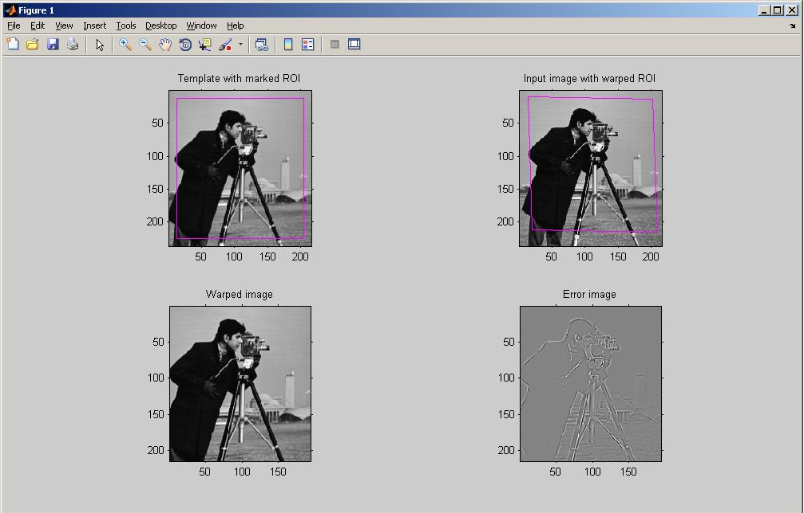

roadmap

show animation over time, how fom-s are evoluting

or not an animation

we want to compare technologies over time

. FOM1 - time of development
. F2 price \~ F1
. F3 accuracy

describe limits of each

.[dominic knoll thesis defence]
https://www.skoltech.ru/app/data/uploads/2019/12/thesis25.pdf 

== impossible problem

Even though modern UAVs havehigh-quality multispectral imaging capabilities, the processing of these images isstill a challenging task for machine vision algorithms due to the complex structureof plants’ topology and broad variety types of background. Partially this problemcan be solved by using Fully Convolutional Neural Network (FCNN) for semanticsegmentation. However, due to the complexity of the proposed problem, existing al-gorithms cannot adequately perform semantic segmentation of diverse plants in fieldconditions. Furthermore, there is still a problem with optimizing high-performancecomputational algorithms for mobile platforms, and resolving this new fundamentalapproach should be investigated and implemented.

== the idea

compare image segmentation + fitting + image merging
with relocalization

Roberto Cristi and Murali Tummala. Multirate, multiresolution, recursive kalmanfilter.Signal Processing, 80(9):1945–1958, 2000.

"G.D. Evangelidis, E.Z. Psarakis, Parametric Image Alignment using Enhanced Correlation Coefficient Maximization", IEEE Trans. on PAMI, vol. 30, no. 10, 2008. ECC algorithm is a direct (gradient-based) image registration algorithm. Due to gradient information, it achieves high accuracy in parameter estimation (i.e. subpixel accuracy). Its performance is invariant to global illumination changes in images since it considers the correlation coefficient (zero-mean normalized cross correlation) as an objective function.

.https://www.mathworks.com/matlabcentral/fileexchange/27253-ecc-image-alignment-algorithm-image-registration 
 

https://sites.google.com/site/imagealignment/tutorials/non-rigid-alignment

https://www.ee.ucl.ac.uk/lcs/previous/LCS2011/LCS1115.pdf
selection  of  exactly  matching  pairs  of  feature  points  in thetwo images == relocalization

the motion model, the measurement model, and theresampling model to enhance the basic particle filter
https://www.researchgate.net/publication/283200167_A_Reliability-Augmented_Particle_Filter_for_Magnetic_Fingerprinting_Based_Indoor_Localization_on_Smartphone/link/5f199ab945851515ef422640/download

The basic particle filter contains three essential compo-nents: the motion model, the measurement model and theresampling model

====
.to read
* "Model-based processes and tools for concurrent conceptual design of space systems — Яндекс: нашлось 27 млн результатов" https://www.yandex.ru/search/?clid=2186621&text=%20%09Model-based%20processes%20and%20tools%20for%20concurrent%20conceptual%20design%20of%20space%20systems&rdrnd=554810&lr=213&redircnt=1602537828.1
* "bande99.pdf" https://www.esa.int/esapub/bulletin/bullet99/bande99.pdf
* "Dominik KNOLL | PhD Student | Doctor of Philosophy | Skolkovo Institute of Science and Technology, Moskovskiy | Skoltech | Space Center" https://www.researchgate.net/profile/Dominik_Knoll
* "Sebastian Haas, Andreas Michaels, Peter Biber, and Jörn Ostermann. Plant… — Яндекс: нашлось 24 млн результатов" https://www.yandex.ru/search/?clid=2186621&text=Sebastian%20Haug%2C%20Andreas%20Michaels%2C%20Peter%20Biber%2C%20and%20J%C3%B6rn%20Ostermann.%20Plant%20clas-sification%20system%20for%20crop%2Fweed%20discrimination%20without%20segmentation.%20InIEEEwinter%20conference%20on%20applications%20of%20computer%20vision%2C%20pages%201142%E2%80%931149.%20IEEE%2C2014&rdrnd=667886&lr=213&redircnt=1602538315.1
* "Extended kalman filter navigation overview and tuning, Accessed March5, 2018.… — Яндекс: нашлось 19 млн результатов" https://www.yandex.ru/search/?clid=2186621&text=Extended%20%20kalman%20%20filter%20%20navigation%20%20overview%20%20and%20%20tuning%2C%20%20Accessed%20%20March5%2C%202018.%20%20http%3A%2F%2Fardupilot.org%2Fdev%2Fdocs%2Fextended-kalman-filter.html%23extended-kalman-filter&rdrnd=406572&lr=213&redircnt=1602538354.1
* "P. Abouzar, D. G. Michelson, and M. Hamdi. Rssi-based distributed… — Яндекс: нашлось 64 млн результатов" https://www.yandex.ru/search/?clid=2186621&text=P.%20Abouzar%2C%20D.%20G.%20Michelson%2C%20and%20M.%20Hamdi.%20Rssi-based%20distributed%20self-localizationfor%20wireless%20sensor%20networks%20used%20in%20precision%20agriculture.IEEE%20Transactionson%20Wireless%20Communications%2C%2015(10)%3A6638%E2%80%936650%2C%20Oct%202016.%20%20ISSN%201536-1276.doi%3A10.1109%2FTWC.2016.2586844.&rdrnd=860366&lr=213&redircnt=1602538389.1
* "Telmo Adão, Jonáš Hruška, Luís Pádua, José Bessa, Emanuel Peres, Raul Morais,and… — Яндекс: нашлось 44 млн результатов" https://www.yandex.ru/search/?clid=2186621&text=Telmo%20Ad%C3%A3o%2C%20Jon%C3%A1%C5%A1%20Hru%C5%A1ka%2C%20Lu%C3%ADs%20P%C3%A1dua%2C%20Jos%C3%A9%20Bessa%2C%20Emanuel%20Peres%2C%20Raul%20Morais%2Cand%20Joaquim%20Sousa.%20Hyperspectral%20imaging%3A%20A%20review%20on%20uav-based%20sensors%2C%20dataprocessing%20and%20applications%20for%20agriculture%20and%20forestry.Remote%20Sensing%2C%209(11)%3A1110%2C%202017&rdrnd=738077&lr=213&redircnt=1602538414.1
* "Amir H. Alavi, Pengcheng Jiao, William G. Buttlar, and Nizar La-jnef. Internet of… — Яндекс: нашлось 86 млн результатов" https://www.yandex.ru/search/?clid=2186621&text=Amir%20%20H.%20%20Alavi%2C%20%20Pengcheng%20%20Jiao%2C%20%20William%20%20G.%20%20Buttlar%2C%20%20and%20%20Nizar%20%20La-jnef.%20%20%20%20Internet%20%20of%20%20things-enabled%20%20smart%20%20cities%3A%20%20%20State-of-the-art%20%20and%20%20fu-ture%20%20trends.Measurement%2C%20%20129%3A589%20%20%E2%80%93%20%20606%2C%20%202018.ISSN%20%200263-2241.doi%3Ahttps%3A%2F%2Fdoi.org%2F10.1016%2Fj.measurement.2018.07.067.&rdrnd=509208&lr=213&redircnt=1602538429.1
* "(PDF) Internet of Things-Enabled Smart Cities: State-of-the-Art and Future Trends" https://www.researchgate.net/publication/326552666_Internet_of_Things-Enabled_Smart_Cities_State-of-the-Art_and_Future_Trends
* "Adrian Carrio, Carlos Sampedro, Alejandro Rodriguez-Ramos, and Pascual Cam-poy. A… — Яндекс: нашлось 28 млн результатов" https://www.yandex.ru/search/?clid=2186621&text=Adrian%20Carrio%2C%20Carlos%20Sampedro%2C%20Alejandro%20Rodriguez-Ramos%2C%20and%20Pascual%20Cam-poy.%20A%20review%20of%20deep%20learning%20methods%20and%20applications%20for%20unmanned%20aerialvehicles.Journal%20of%20Sensors%2C%202017%2C%202017&rdrnd=452565&lr=213&redircnt=1602538602.1
* "Roberto Cristi and Murali Tummala. Multirate, multiresolution, recursive… — Яндекс: нашлось 28 млн результатов" https://www.yandex.ru/search/?clid=2186621&text=Roberto%20Cristi%20and%20Murali%20Tummala.%20Multirate%2C%20multiresolution%2C%20recursive%20kalmanfilter.Signal%20Processing%2C%2080(9)%3A1945%E2%80%931958%2C%202000.&rdrnd=795165&lr=213&redircnt=1602538655.1
* "Jifeng Dai, Kaiming He, and Jian Sun. Convolutional feature masking for joint… — Яндекс: нашлось 30 млн результатов" https://www.yandex.ru/search/?clid=2186621&text=Jifeng%20Dai%2C%20Kaiming%20He%2C%20and%20Jian%20Sun.%20Convolutional%20feature%20masking%20for%20joint%20ob-ject%20and%20stuff%20segmentation.%20InProceedings%20of%20the%20IEEE%20Conference%20on%20ComputerVision%20and%20Pattern%20Recognition%2C%20pages%203992%E2%80%934000%2C%202015&rdrnd=630532&lr=213&redircnt=1602538687.1
* "images alignment algorithm relokalization — Яндекс: нашлось 9 млн результатов" https://www.yandex.ru/search/?clid=2186621&text=images%20alignment%20algorithm%20relokalization%20&rdrnd=742493&lr=213&redircnt=1602538748.1
* "ECC image alignment algorithm (image registration) - File Exchange - MATLAB Central" https://www.mathworks.com/matlabcentral/fileexchange/27253-ecc-image-alignment-algorithm-image-registration
* "Documentation - Image Alignment Toolbox" https://sites.google.com/site/imagealignment/documentation
* "Tutorials - Image Alignment Toolbox" https://sites.google.com/site/imagealignment/tutorials
* "Area-based (direct) alignment - Image Alignment Toolbox" https://sites.google.com/site/imagealignment/tutorials/area-based-alignment
* "Feature-based alignment - Image Alignment Toolbox" https://sites.google.com/site/imagealignment/tutorials/feature-based-alignment
* "Feature-based Vs Direct Image Alignment - Image Alignment Toolbox" https://sites.google.com/site/imagealignment/tutorials/feature-based-vs-direct-image-alignment
* "Non-rigid alignment - Image Alignment Toolbox" https://sites.google.com/site/imagealignment/tutorials/non-rigid-alignment
* "LCS1115.pdf" https://www.ee.ucl.ac.uk/lcs/previous/LCS2011/LCS1115.pdf
* "Image Alignment Algorithms - CodeProject" https://www.codeproject.com/Articles/24809/Image-Alignment-Algorithms
* "video - Image stabilization/alignment algorithm - Stack Overflow" https://stackoverflow.com/questions/3532133/image-stabilization-alignment-algorithm
* "1904.11932.pdf" https://arxiv.org/pdf/1904.11932.pdf
* "(PDF) Skeletonization Algorithm for Binary Images" https://www.researchgate.net/publication/275539079_Skeletonization_Algorithm_for_Binary_Images
* "An Analysis of Rigid Image Alignment Computer Vision Algorithms - viewcontent.cgi" https://digitalcommons.georgiasouthern.edu/cgi/viewcontent.cgi?article=1687&context=etd
* "(PDF) INTERPOLATION ALGORITHMS FOR IMAGE SCALING" https://www.researchgate.net/publication/228772696_INTERPOLATION_ALGORITHMS_FOR_IMAGE_SCALING
* "Image Alignment (Feature Based) using OpenCV (C++/Python) | Learn OpenCV" https://www.learnopencv.com/image-alignment-feature-based-using-opencv-c-python/
* "Feature-based alignment - Image Alignment Toolbox" https://www.sites.google.com/site/imagealignment/tutorials/feature-based-alignment
* "relocalization navigation algorithm — Яндекс: нашлось 3 млн результатов" https://www.yandex.ru/search/?text=relocalization%20navigation%20algorithm&lr=213&clid=2186621
* "GitHub - focs/svo_relocalization: Relocalization algorithm" https://github.com/focs/svo_relocalization
* "relocalization - Wiktionary" https://en.wiktionary.org/wiki/relocalization
* "1803.01549.pdf" https://arxiv.org/pdf/1803.01549.pdf
* "magnetic fingerprinting relocalization — Яндекс: нашлось 2 млн результатов" https://www.yandex.ru/search/?text=magnetic%20fingerprinting%20relocalization&lr=213&clid=2186621
* "Data relocalization to mitigate slow convergence caused by under-resolved stress fields in computational damage mechanics | Request PDF" https://www.researchgate.net/publication/262526760_Data_relocalization_to_mitigate_slow_convergence_caused_by_under-resolved_stress_fields_in_computational_damage_mechanics
* "Magnetometer Overview | Stereolabs" https://www.stereolabs.com/docs/sensors/magnetometer/
* "Quick Start Guide | Stereolabs" https://www.stereolabs.com/docs/installation/
* "ResearchGate" https://www.researchgate.net/publication/283200167_A_Reliability-Augmented_Particle_Filter_for_Magnetic_Fingerprinting_Based_Indoor_Localization_on_Smartphone/link/5f199ab945851515ef422640/download
* "A Reliability-Augmented Particle Filter for Magnetic Fingerprinting Based Indoor Localization on Smartphone - 7272098.pdf" file:///tmp/mozilla_tim0/7272098.pdf
* "Magnetic resonance fingerprinting - mr_fingerprinting_nature11971.pdf" https://mriquestions.com/uploads/3/4/5/7/34572113/mr_fingerprinting_nature11971.pdf
* "Gulani_MRF_MAGNETOM_Flash_ISMRM_2016.pdf" http://clinical-mri.com/wp-content/uploads/2016/04/Gulani_MRF_MAGNETOM_Flash_ISMRM_2016.pdf
* "1802.10492.pdf" https://arxiv.org/pdf/1802.10492.pdf
* "RinQ Fingerprinting: Recurrence-Informed Quantile Networks for Magnetic Resonance Fingerprinting | SpringerLink" https://link.springer.com/chapter/10.1007/978-3-030-32248-9_11
* "multicompartment_mrf.pdf" https://cims.nyu.edu/~cfgranda/pages/stuff/multicompartment_mrf.pdf
* "A Magnetic Fingerprinting-Based Precise Automobile Localization Using Smartphones | Semantic Scholar" https://www.semanticscholar.org/paper/A-Magnetic-Fingerprinting-Based-Precise-Automobile-Jeon-Lee/2c116b88376454b967784a4c5b4e0d6991177a82
* "Magnetic Resonance Fingerprinting using Recurrent Neural Networks | Papers With Code" https://paperswithcode.com/paper/magnetic-resonance-fingerprinting-using
~
====

https://arxiv.org/pdf/1412.1283.pdf
use convolutions to register same points?????

conceptually the same as for matlab example

Situational Awareness.Cross-view localization of imagesis achieved with the help of deep learning in [59]. Althoughthe work is presented as a solution for UAV localiz

what is the optimal walking procedure to measure the data

imu noise >>> can't estimate speed.

can estimate zero speed >> for recalibration of imu we may walk with series of steps.

>> walking man model. >> use model to predict step size >> prior information on step size estimation >> better predictions

//We show that such common path information greatly influencesprediction  of  future  movement.
https://arxiv.org/pdf/1808.04018.pdf

Feature selection is a necessary step which consists of selecting a subset of relevant data features with higher quality information within the original feature set to represent the nature  of  the  data. The  objectiveof  feature  selectionis  to determinethe  most informative and influential features used torecognize and representhuman walking behavior toprovide accurate step prediction. Using   the   kinematic   physical   features,   derived   from   the measurement parameters of human motion,the statistical features and overall feature space is enhanced with a broad reach ofrepresentative metrics[14]. Redundancy of data tends to incorrectly model the systems behavior and leads to loss of accuracy by incorrect predictions.For  this  reason,  it  was  desirable  to  include many  varyingderived  physical  inertial components  of  the  measured  foot  IMU  data,derivedstatistical  metrics and  representativeglobal window features such as overall time and distance in attempt to recognize the model’s behavior as accurately as possible.Traditionally, in human gait analysis, features such as mean, variance, correlation, and Fast Fourier Transform (FFT)coefficients computed from motion measurement sensorsare depended on for recognition[3].

27profound  ability  to  learn  incrementally.  The  KNN  method  adapts  well  to  learning  and predicting data streams, where it can determine the closest matched instance of new data. It  performs exceptionally  well  at  observing  and  classifying  new  and  complex  instancesof data,  compared  to  other  supervised  learning  methods.  This  makes  the  KNN  algorithm  a highly desired method for this work

=== Test

