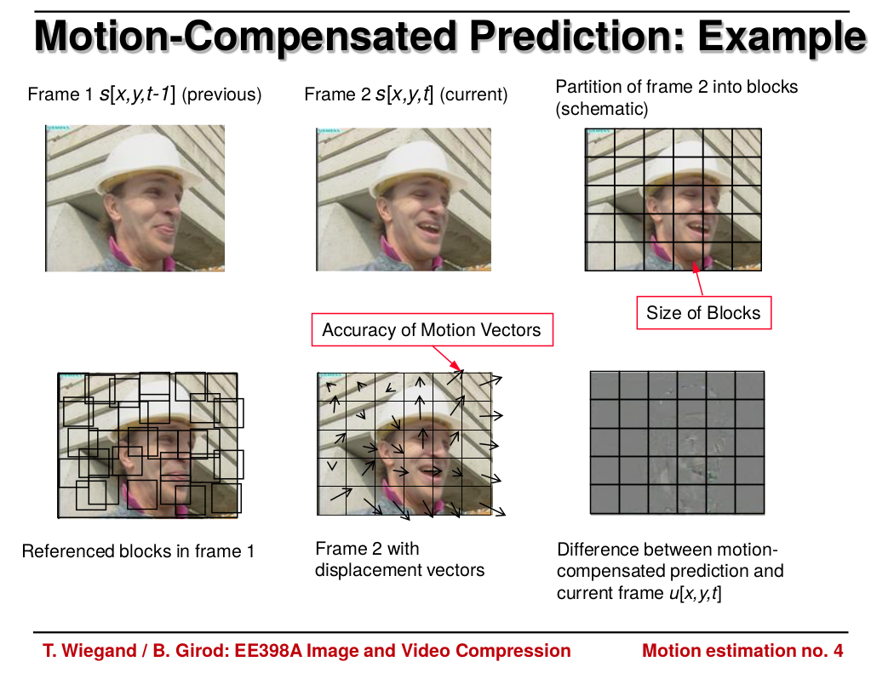
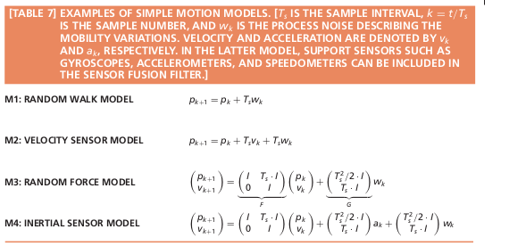
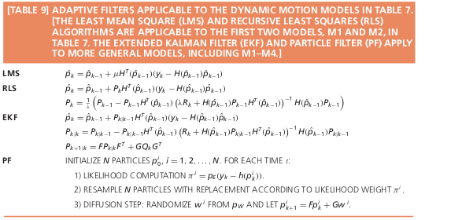
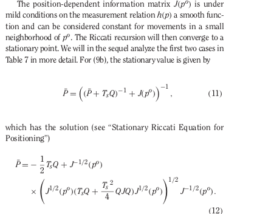
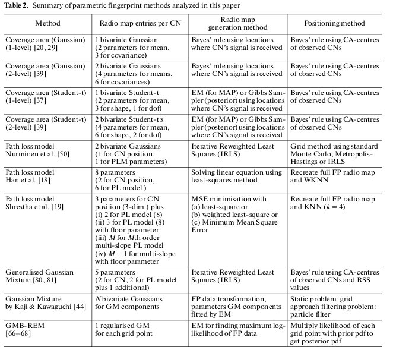
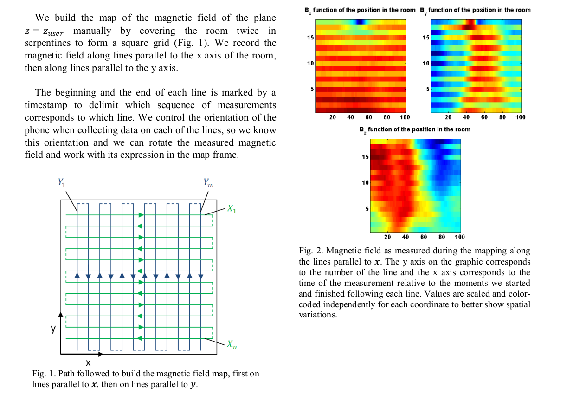

:stem: latexmath

//tag::ch1[]

// ====
// A statement of the methodology for the thesis project that defines specific design of the procedures, data collection, analysis, and (or) interpretation. Illustrate how the method you have chosen best allows you to fulfill the purpose of the thesis project.
// ====

// First we define the current state of the art, we build the model for existing technologies, analyze products on the market, list key players and IP owners, create Pareto frontier. This part is intended  to  make  a  visible  and  understandable  landscape  of this technology segment.
// // To develop the right product, we first have to identify its figures of merit.
// // When the figures of merits stated, we have to choose the right technology. First we develop the framework for technology choice.

// // We do a theoretical research, from which we decide on a technology and methods. This we call a roadmap, because it gives us some prior assumptions of next series of steps to be done.

// .The road map:
// * show the evolution of IPS technology
// ** repeat the research of indoor positioning systems review (example, one of the most useful for now) or other IPS publications
// ** visualize IPS usage and work principles (different technologies, connections, FOMs, applications)
// * create financial and technical models for different IPS technologies
// * calculate the possible effect of merging different technologies for different applications
// ** calculate in FOMs / prices (novelty)
// * connect different technologies into single model (where possible)
// * create system / strategy for optimal* technology choice decision
// ** map / compare existing products and trends over defined figures of merit

// // image:/home/tim/Downloads/inndoor%20navigation/img/image2020-5-29_23-2-21.png[]

// .Preparation landscape research
// First, we define the current state of the art, we build the model for existing technologies, analyze products on the market, list key players and IP owners, create Pareto frontier. This part is intended to make a visible and understandable landscape of this technology segment.

// // A statement of the methodology for the thesis project that defines the specific design of the procedures, data collection, analysis, and (or) interpretation. Illustrate how the method you have chosen best allows you to fulfill the purpose of the thesis project.

// .Procedures list
// * Collection of magnetic fingerprints database with smartphone sensors: Gyroscope, compass, IMU.
// * Implementation of localization model
// * Experiments using model, estimation of accuracy
// * Implementation of possible techniques, benchmarking
// * SLAM model development, re-localization technique, map-merging
// * Fine-tuning of SLAM model
// * Comparison to other products, interpretation of results

// // Illustrate how the method you have chosen best allows you to fulfill the purpose

// // The method we have chosen is reasonable

Problem: SLAM algorithm with no odometry available.

We have a Markov process. After processing to the point with high confidence we may recalculate all previous positions - close loop.

Close loop examples??????

Reestimate previous coordinates - regression task.

\section{measurements model}

acceleration data from imu \\
magnetic field orientation vector \\
RSSI

Consider the process is Markovian.

\section{Transition model definition}

Copied all from \cite{articleXia}:

With  the  development  of  microelectromechanical  systems(MEMS),  a  few  MEMS-based  sensors  have  been  built  and
incorporated  into  smartphones:  accelerometers,  gyroscopes,magnetometers,  etc.  These  sensors  can  be  used  to  provide information  on  the  user’s  actions.  Pedestrian  dead  reckon-ing  (PDR)  [10]  is  a  relative  navigation  technique  that  uses these sensors.

we propose a PDR-based  indoor positioningmethod  that  integrates  RSSI  with  indoor  environment  mapconstraints by using particle filters.

PDR-based indoor positioning can be expressed by the following equations

// asciimath:[]

latexmath:[
\begin{equation}
    X_k = \
    \begin{bmatrix} 
        x_{t-1} \\
        y_{t-1} 
    \end{bmatrix} = \
    \begin{bmatrix} 
        x_{t-1} &+ l_k \sin(\theta_t) \\
        y_{t-1} &+ l_k \cos(\theta_t) 
    \end{bmatrix} + \
    \begin{bmatrix} 
        \delta_{x} \\
        \delta_{y} 
    \end{bmatrix}
\end{equation}
]

The orientation  updates is independent from $X_k$ updates, depends on accelerometer and gyro, same model.

Step   Detection:Android   mobile   phones   have   two kinds  of  sensors  to  monitor  steps:  step  counters  and  step detectors [25]. 

Peak detection is used in this paper for step detection

nonlinear step length estimation model based on statistics proposed by Weinberg [27]

// latexmath:[
// ]

\begin{equation}
// s_z = k \sqrt{a}
step_{size} = k \sqrt ^4{a_{z max} - a_{z min}}
\end{equation}

The Android system computes orientation angles by using the  device’s  geomagnetic  sensors  in  combination  with  its accelerometers   [25].   Using   these   two   hardware   sensors,the  system  provides  data  for  the  following  three  orientation angles

The  device is NOT  assumed to  be pointing in the heading direction. Need to apply additional space transformation.

\subsection{RSSI methode}

Usual path-loss model:

\begin{equation}
    PL(d) = PL(d0) + 10 \alpha \log{d / d_0} + \omega = 
    PL(d0) + 10 \alpha \log{d / d_0} + N(0, \sigma^2_{\omega})
\end{equation}

where $d$ represents the Euclidean distance between the anchor node  and  the  receiver,d0represents  a  specified  distance,PL(d)and PL(d0)represent the RSSI at $d$ and $d_0$, respectively(in  dBm),  andαrepresents the  path  loss  exponent, which  is closely related to the ambient environment;ωis a zero-mean Gaussian distribution variable with variance $\sigma^2_{\omega}$.

The inverse function: 
\begin{equation}
    d_i = d_0 \cdot 10 \frac{PL(d_i) - PL(d_0)}{10\alpha}
\end{equation}

Landmark model:

\begin{align}
    f_i(x, y) &= d_i - \sqrt{(x - x_i)^2 + (y - y_i)^2} \\
    min(x, y) &= min \sum_{i=1}^{m}[f_i(x, y)]^2, m \ge 3.
\end{align}

In paper author transform this to linear system, 

\begin{align}
    AZ & = b \\
    A &= \begin{bmatrix} 
        1 - 2 x_1 - 2 y_1 \\
        ... \\
        1 - 2 x_m - 2 y_m
    \end{bmatrix} \\
    Z &= \begin{bmatrix} 
        x^2 + y^2 \\
        x \\
        y
    \end{bmatrix} \\
    b &= \begin{bmatrix} 
        d_1^2 - x_1^2 - y_2^2\\
        ...\\
        ...
    \end{bmatrix}
\end{align}

We have to check it

Good alternative was proposed in \cite{} to bound region by min and max RSSI according to its variance - linear system.

\subsection{Processing}

Update step, prediction, correction
State Estimation

Resample:In  this  step,  importance  resampling  [20]  isused to obtain a new particle set

some papers prove importance resampling can't be applied for this task because pf noise.
% observation equation:

\section{Crasy Idea}

There is some similarity in video compressing process

We strore gradients of changing signal measurements, we apply searching procedure to have a smooth measurements.

We have a convex magnetic field and a trajectory, 
the task is to find similar trajectrory with highest correlation to measurements.

Regression, approximation, pattern matching, Convolutions.

Gradients, blockmatching

Different approaches in papers, play on a toy model.

//end::ch1[]

roadmap

show animation over time, how fom-s are evoluting

or not an animation

we want to compare technologies over time

. FOM1 - time of development
. F2 price \~ F1
. F3 accuracy

describe limits of each

.[dominic knoll thesis defence]
https://www.skoltech.ru/app/data/uploads/2019/12/thesis25.pdf 

== impossible problem

Even though modern UAVs havehigh-quality multispectral imaging capabilities, the processing of these images isstill a challenging task for machine vision algorithms due to the complex structureof plants’ topology and broad variety types of background. Partially this problemcan be solved by using Fully Convolutional Neural Network (FCNN) for semanticsegmentation. However, due to the complexity of the proposed problem, existing al-gorithms cannot adequately perform semantic segmentation of diverse plants in fieldconditions. Furthermore, there is still a problem with optimizing high-performancecomputational algorithms for mobile platforms, and resolving this new fundamentalapproach should be investigated and implemented.

== the idea

compare image segmentation + fitting + image merging
with relocalization

Roberto Cristi and Murali Tummala. Multirate, multiresolution, recursive kalmanfilter.Signal Processing, 80(9):1945–1958, 2000.

"G.D. Evangelidis, E.Z. Psarakis, Parametric Image Alignment using Enhanced Correlation Coefficient Maximization", IEEE Trans. on PAMI, vol. 30, no. 10, 2008. ECC algorithm is a direct (gradient-based) image registration algorithm. Due to gradient information, it achieves high accuracy in parameter estimation (i.e. subpixel accuracy). Its performance is invariant to global illumination changes in images since it considers the correlation coefficient (zero-mean normalized cross correlation) as an objective function.

.https://www.mathworks.com/matlabcentral/fileexchange/27253-ecc-image-alignment-algorithm-image-registration 
image:2-10-2020-00-41-30-AM.png[] 

https://sites.google.com/site/imagealignment/tutorials/non-rigid-alignment

https://www.ee.ucl.ac.uk/lcs/previous/LCS2011/LCS1115.pdf
selection  of  exactly  matching  pairs  of  feature  points  in thetwo images == relocalization

the motion model, the measurement model, and theresampling model to enhance the basic particle filter
https://www.researchgate.net/publication/283200167_A_Reliability-Augmented_Particle_Filter_for_Magnetic_Fingerprinting_Based_Indoor_Localization_on_Smartphone/link/5f199ab945851515ef422640/download

The basic particle filter contains three essential compo-nents: the motion model, the measurement model and theresampling model

====
.to read
* "Model-based processes and tools for concurrent conceptual design of space systems — Яндекс: нашлось 27 млн результатов" https://www.yandex.ru/search/?clid=2186621&text=%20%09Model-based%20processes%20and%20tools%20for%20concurrent%20conceptual%20design%20of%20space%20systems&rdrnd=554810&lr=213&redircnt=1602537828.1
* "bande99.pdf" https://www.esa.int/esapub/bulletin/bullet99/bande99.pdf
* "Dominik KNOLL | PhD Student | Doctor of Philosophy | Skolkovo Institute of Science and Technology, Moskovskiy | Skoltech | Space Center" https://www.researchgate.net/profile/Dominik_Knoll
* "Sebastian Haas, Andreas Michaels, Peter Biber, and Jörn Ostermann. Plant… — Яндекс: нашлось 24 млн результатов" https://www.yandex.ru/search/?clid=2186621&text=Sebastian%20Haug%2C%20Andreas%20Michaels%2C%20Peter%20Biber%2C%20and%20J%C3%B6rn%20Ostermann.%20Plant%20clas-sification%20system%20for%20crop%2Fweed%20discrimination%20without%20segmentation.%20InIEEEwinter%20conference%20on%20applications%20of%20computer%20vision%2C%20pages%201142%E2%80%931149.%20IEEE%2C2014&rdrnd=667886&lr=213&redircnt=1602538315.1
* "Extended kalman filter navigation overview and tuning, Accessed March5, 2018.… — Яндекс: нашлось 19 млн результатов" https://www.yandex.ru/search/?clid=2186621&text=Extended%20%20kalman%20%20filter%20%20navigation%20%20overview%20%20and%20%20tuning%2C%20%20Accessed%20%20March5%2C%202018.%20%20http%3A%2F%2Fardupilot.org%2Fdev%2Fdocs%2Fextended-kalman-filter.html%23extended-kalman-filter&rdrnd=406572&lr=213&redircnt=1602538354.1
* "P. Abouzar, D. G. Michelson, and M. Hamdi. Rssi-based distributed… — Яндекс: нашлось 64 млн результатов" https://www.yandex.ru/search/?clid=2186621&text=P.%20Abouzar%2C%20D.%20G.%20Michelson%2C%20and%20M.%20Hamdi.%20Rssi-based%20distributed%20self-localizationfor%20wireless%20sensor%20networks%20used%20in%20precision%20agriculture.IEEE%20Transactionson%20Wireless%20Communications%2C%2015(10)%3A6638%E2%80%936650%2C%20Oct%202016.%20%20ISSN%201536-1276.doi%3A10.1109%2FTWC.2016.2586844.&rdrnd=860366&lr=213&redircnt=1602538389.1
* "Telmo Adão, Jonáš Hruška, Luís Pádua, José Bessa, Emanuel Peres, Raul Morais,and… — Яндекс: нашлось 44 млн результатов" https://www.yandex.ru/search/?clid=2186621&text=Telmo%20Ad%C3%A3o%2C%20Jon%C3%A1%C5%A1%20Hru%C5%A1ka%2C%20Lu%C3%ADs%20P%C3%A1dua%2C%20Jos%C3%A9%20Bessa%2C%20Emanuel%20Peres%2C%20Raul%20Morais%2Cand%20Joaquim%20Sousa.%20Hyperspectral%20imaging%3A%20A%20review%20on%20uav-based%20sensors%2C%20dataprocessing%20and%20applications%20for%20agriculture%20and%20forestry.Remote%20Sensing%2C%209(11)%3A1110%2C%202017&rdrnd=738077&lr=213&redircnt=1602538414.1
* "Amir H. Alavi, Pengcheng Jiao, William G. Buttlar, and Nizar La-jnef. Internet of… — Яндекс: нашлось 86 млн результатов" https://www.yandex.ru/search/?clid=2186621&text=Amir%20%20H.%20%20Alavi%2C%20%20Pengcheng%20%20Jiao%2C%20%20William%20%20G.%20%20Buttlar%2C%20%20and%20%20Nizar%20%20La-jnef.%20%20%20%20Internet%20%20of%20%20things-enabled%20%20smart%20%20cities%3A%20%20%20State-of-the-art%20%20and%20%20fu-ture%20%20trends.Measurement%2C%20%20129%3A589%20%20%E2%80%93%20%20606%2C%20%202018.ISSN%20%200263-2241.doi%3Ahttps%3A%2F%2Fdoi.org%2F10.1016%2Fj.measurement.2018.07.067.&rdrnd=509208&lr=213&redircnt=1602538429.1
* "(PDF) Internet of Things-Enabled Smart Cities: State-of-the-Art and Future Trends" https://www.researchgate.net/publication/326552666_Internet_of_Things-Enabled_Smart_Cities_State-of-the-Art_and_Future_Trends
* "Adrian Carrio, Carlos Sampedro, Alejandro Rodriguez-Ramos, and Pascual Cam-poy. A… — Яндекс: нашлось 28 млн результатов" https://www.yandex.ru/search/?clid=2186621&text=Adrian%20Carrio%2C%20Carlos%20Sampedro%2C%20Alejandro%20Rodriguez-Ramos%2C%20and%20Pascual%20Cam-poy.%20A%20review%20of%20deep%20learning%20methods%20and%20applications%20for%20unmanned%20aerialvehicles.Journal%20of%20Sensors%2C%202017%2C%202017&rdrnd=452565&lr=213&redircnt=1602538602.1
* "Roberto Cristi and Murali Tummala. Multirate, multiresolution, recursive… — Яндекс: нашлось 28 млн результатов" https://www.yandex.ru/search/?clid=2186621&text=Roberto%20Cristi%20and%20Murali%20Tummala.%20Multirate%2C%20multiresolution%2C%20recursive%20kalmanfilter.Signal%20Processing%2C%2080(9)%3A1945%E2%80%931958%2C%202000.&rdrnd=795165&lr=213&redircnt=1602538655.1
* "Jifeng Dai, Kaiming He, and Jian Sun. Convolutional feature masking for joint… — Яндекс: нашлось 30 млн результатов" https://www.yandex.ru/search/?clid=2186621&text=Jifeng%20Dai%2C%20Kaiming%20He%2C%20and%20Jian%20Sun.%20Convolutional%20feature%20masking%20for%20joint%20ob-ject%20and%20stuff%20segmentation.%20InProceedings%20of%20the%20IEEE%20Conference%20on%20ComputerVision%20and%20Pattern%20Recognition%2C%20pages%203992%E2%80%934000%2C%202015&rdrnd=630532&lr=213&redircnt=1602538687.1
* "images alignment algorithm relokalization — Яндекс: нашлось 9 млн результатов" https://www.yandex.ru/search/?clid=2186621&text=images%20alignment%20algorithm%20relokalization%20&rdrnd=742493&lr=213&redircnt=1602538748.1
* "ECC image alignment algorithm (image registration) - File Exchange - MATLAB Central" https://www.mathworks.com/matlabcentral/fileexchange/27253-ecc-image-alignment-algorithm-image-registration
* "Documentation - Image Alignment Toolbox" https://sites.google.com/site/imagealignment/documentation
* "Tutorials - Image Alignment Toolbox" https://sites.google.com/site/imagealignment/tutorials
* "Area-based (direct) alignment - Image Alignment Toolbox" https://sites.google.com/site/imagealignment/tutorials/area-based-alignment
* "Feature-based alignment - Image Alignment Toolbox" https://sites.google.com/site/imagealignment/tutorials/feature-based-alignment
* "Feature-based Vs Direct Image Alignment - Image Alignment Toolbox" https://sites.google.com/site/imagealignment/tutorials/feature-based-vs-direct-image-alignment
* "Non-rigid alignment - Image Alignment Toolbox" https://sites.google.com/site/imagealignment/tutorials/non-rigid-alignment
* "LCS1115.pdf" https://www.ee.ucl.ac.uk/lcs/previous/LCS2011/LCS1115.pdf
* "Image Alignment Algorithms - CodeProject" https://www.codeproject.com/Articles/24809/Image-Alignment-Algorithms
* "video - Image stabilization/alignment algorithm - Stack Overflow" https://stackoverflow.com/questions/3532133/image-stabilization-alignment-algorithm
* "1904.11932.pdf" https://arxiv.org/pdf/1904.11932.pdf
* "(PDF) Skeletonization Algorithm for Binary Images" https://www.researchgate.net/publication/275539079_Skeletonization_Algorithm_for_Binary_Images
* "An Analysis of Rigid Image Alignment Computer Vision Algorithms - viewcontent.cgi" https://digitalcommons.georgiasouthern.edu/cgi/viewcontent.cgi?article=1687&context=etd
* "(PDF) INTERPOLATION ALGORITHMS FOR IMAGE SCALING" https://www.researchgate.net/publication/228772696_INTERPOLATION_ALGORITHMS_FOR_IMAGE_SCALING
* "Image Alignment (Feature Based) using OpenCV (C++/Python) | Learn OpenCV" https://www.learnopencv.com/image-alignment-feature-based-using-opencv-c-python/
* "Feature-based alignment - Image Alignment Toolbox" https://www.sites.google.com/site/imagealignment/tutorials/feature-based-alignment
* "relocalization navigation algorithm — Яндекс: нашлось 3 млн результатов" https://www.yandex.ru/search/?text=relocalization%20navigation%20algorithm&lr=213&clid=2186621
* "GitHub - focs/svo_relocalization: Relocalization algorithm" https://github.com/focs/svo_relocalization
* "relocalization - Wiktionary" https://en.wiktionary.org/wiki/relocalization
* "1803.01549.pdf" https://arxiv.org/pdf/1803.01549.pdf
* "magnetic fingerprinting relocalization — Яндекс: нашлось 2 млн результатов" https://www.yandex.ru/search/?text=magnetic%20fingerprinting%20relocalization&lr=213&clid=2186621
* "Data relocalization to mitigate slow convergence caused by under-resolved stress fields in computational damage mechanics | Request PDF" https://www.researchgate.net/publication/262526760_Data_relocalization_to_mitigate_slow_convergence_caused_by_under-resolved_stress_fields_in_computational_damage_mechanics
* "Magnetometer Overview | Stereolabs" https://www.stereolabs.com/docs/sensors/magnetometer/
* "Quick Start Guide | Stereolabs" https://www.stereolabs.com/docs/installation/
* "ResearchGate" https://www.researchgate.net/publication/283200167_A_Reliability-Augmented_Particle_Filter_for_Magnetic_Fingerprinting_Based_Indoor_Localization_on_Smartphone/link/5f199ab945851515ef422640/download
* "A Reliability-Augmented Particle Filter for Magnetic Fingerprinting Based Indoor Localization on Smartphone - 7272098.pdf" file:///tmp/mozilla_tim0/7272098.pdf
* "Magnetic resonance fingerprinting - mr_fingerprinting_nature11971.pdf" https://mriquestions.com/uploads/3/4/5/7/34572113/mr_fingerprinting_nature11971.pdf
* "Gulani_MRF_MAGNETOM_Flash_ISMRM_2016.pdf" http://clinical-mri.com/wp-content/uploads/2016/04/Gulani_MRF_MAGNETOM_Flash_ISMRM_2016.pdf
* "1802.10492.pdf" https://arxiv.org/pdf/1802.10492.pdf
* "RinQ Fingerprinting: Recurrence-Informed Quantile Networks for Magnetic Resonance Fingerprinting | SpringerLink" https://link.springer.com/chapter/10.1007/978-3-030-32248-9_11
* "multicompartment_mrf.pdf" https://cims.nyu.edu/~cfgranda/pages/stuff/multicompartment_mrf.pdf
* "A Magnetic Fingerprinting-Based Precise Automobile Localization Using Smartphones | Semantic Scholar" https://www.semanticscholar.org/paper/A-Magnetic-Fingerprinting-Based-Precise-Automobile-Jeon-Lee/2c116b88376454b967784a4c5b4e0d6991177a82
* "Magnetic Resonance Fingerprinting using Recurrent Neural Networks | Papers With Code" https://paperswithcode.com/paper/magnetic-resonance-fingerprinting-using
~
====

https://arxiv.org/pdf/1412.1283.pdf
use convolutions to register same points?????

conceptually the same as for matlab example

Situational Awareness.Cross-view localization of imagesis achieved with the help of deep learning in [59]. Althoughthe work is presented as a solution for UAV localiz

what is the optimal walking procedure to measure the data

imu noise >>> can't estimate speed.

can estimate zero speed >> for recalibration of imu we may walk with series of steps.

>> walking man model. >> use model to predict step size >> prior information on step size estimation >> better predictions

//We show that such common path information greatly influencesprediction  of  future  movement.
https://arxiv.org/pdf/1808.04018.pdf

Feature selection is a necessary step which consists of selecting a subset of relevant data features with higher quality information within the original feature set to represent the nature  of  the  data. The  objectiveof  feature  selectionis  to determinethe  most informative and influential features used torecognize and representhuman walking behavior toprovide accurate step prediction. Using   the   kinematic   physical   features,   derived   from   the measurement parameters of human motion,the statistical features and overall feature space is enhanced with a broad reach ofrepresentative metrics[14]. Redundancy of data tends to incorrectly model the systems behavior and leads to loss of accuracy by incorrect predictions.For  this  reason,  it  was  desirable  to  include many  varyingderived  physical  inertial components  of  the  measured  foot  IMU  data,derivedstatistical  metrics and  representativeglobal window features such as overall time and distance in attempt to recognize the model’s behavior as accurately as possible.Traditionally, in human gait analysis, features such as mean, variance, correlation, and Fast Fourier Transform (FFT)coefficients computed from motion measurement sensorsare depended on for recognition[3].

27profound  ability  to  learn  incrementally.  The  KNN  method  adapts  well  to  learning  and predicting data streams, where it can determine the closest matched instance of new data. It  performs exceptionally  well  at  observing  and  classifying  new  and  complex  instancesof data,  compared  to  other  supervised  learning  methods.  This  makes  the  KNN  algorithm  a highly desired method for this work

=== Test

T. Wiegand / B. Girod: EE398A Image and Video Compression
Motion estimation no. 1

image:1-11-2020-13-33-26-PM.png[] 
 

image:1-11-2020-13-34-37-PM.png[] 

Continuous Time Bayesian Networks

Mobile Positioning Using
Wireless Networks

Digital map information: y t = h MAP (p t , p i ) + e t . A digital
map contains, for instance, RSS measurements relative the
reference points either predicted or provided via dedicated
measurement scans in the service area.

image:1-11-2020-13-37-25-PM.png[] 

 

 

A short road path to implement a positioning system is as
follows

. Collect the available measurements in Table 2.
. Compute the static CRB using (3) or using (4a) in the Gaussian case.
. Compare this to the FCC requirements in Table 1.
. If these are not satisfied, continue with step 5. Otherwise, evaluate algorithms based on one of the criteria in Table 3 using one of the algorithms in Table 4. If these algorithms do not yield a satisfactory result, continue with step 5.
. Select a motion model in Table 7.
. Compare the CRB to the FCC requirements in Table 8.
. If these are satisfied, try to find an algorithm in Table 9
that gives satisfactory result. If this fails, try to change the
system configuration to obtain better measurements, or
equip the MS with more sensors.

 

A Survey of Parametric FingerprintPositioning Methods 1

image:1-11-2020-13-43-19-PM.png[] 

image:1-11-2020-13-43-59-PM.png[] 

 

From Maloc Xie, Hongwei & Gu, Tao & Tao, Xianping & Ye, Haibo & Lu, Jian. (2015). A Reliability-Augmented Particle Filter for Magnetic Fingerprinting Based Indoor Localization on Smartphone. IEEE Transactions on Mobile Computing. 15. 1-1. 10.1109/TMC.2015.2480064. 

image:1-11-2020-13-48-44-PM.png[] 

.magnetic field compensation algorithm
image:1-11-2020-13-50-05-PM.png[] 

image:1-11-2020-13-50-56-PM.png[] 

Pathapati Subbu, K. S. (2011). Indoor localization using magnetic fields (Order No. 3529276). Available from ProQuest Dissertations & Theses Global: The Sciences and Engineering Collection. (1046660250). Retrieved from https://search.proquest.com.proxylib.skoltech.ru:2050/docview/1046660250?accountid=196286 

Fundamental paper, read, apply

Burgard W. (2005) Probabilistic Techniques for Mobile Robot Navigation. In: Cohn A.G., Mark D.M. (eds) Spatial Information Theory. COSIT 2005. Lecture Notes in Computer Science, vol 3693. Springer, Berlin, Heidelberg. https://doi.org.proxylib.skoltech.ru:2050/10.1007/11556114_31

image:1-11-2020-14-36-36-PM.png[] 

=== 3-Axis Magnetic Field Mapping and Fusion for Indoor Localization

https://www.semanticscholar.org/paper/3-Axis-magnetic-field-mapping-and-fusion-for-indoor-Grand-Thrun/da91e43d72afe677718f769ddd2b3ae86d7bc3fb

image:1-11-2020-14-55-07-PM.png[] 

 

relocalization with magnetic field

loop closure

large graph, adding connection

relocalization

inertial positioning

image:home/tim/Pictures/sdljdlbjsdv.png[]