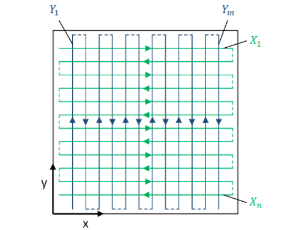
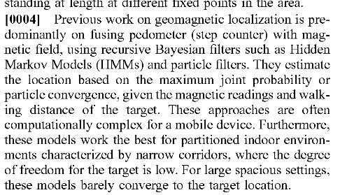

=== from www.hindawi.com
https://www.hindawi.com/journals/js/2016/1945695/ 

Indoor magnetic field based positioning generally has 
two phases: 
model training phase and 
fingerprint localization phase. 
// In the 
.model training phase: 
* trainers collect spatial fingerprint signal
* mark them with location information
* generate the localization model

fingerprint localization phase
* collect real-time fingerprint signal
* estimate users’ locations by comparing the real-time fingerprint signals and the localization model

// Thisprocess is usually implemented by 
comparing the similarity between the target segment and all candidate segments in the model with a *sliding window* technique. 
// However, falsepositions (𝑃1and𝑃2) sometimes are more similar than thetrue position𝑃0due to the interferences analyzed in the lastsection. 

// Fingerprint segment distinguishability is proportional to segment length while it is inversely proportional to model fin-gerprint length. 

Fingerprint segment distinguishability, 
Fingerprint length, model length

// ignal similarity between a target segment and acandidate segment can be measured with mean Euclideandistance between them

only one dimension is considered

IDEA:: to model in two dimesions we have to construct multiple proposals with markov chain

fingerprint extraction methods 
// are studied to reject location-unrelated signal components: 
wavelet trans-form, Savitzky–Golay filter,moving average filter, wavelet denoising, and Butterworth filter

Butterworthfilter fingerprint has the highest distinguishability among allthese extracted fingerprints, since it rejects noise based onthe signal’s frequency rather than simple average adjacentmeasurements.
Considering the indoor MFM mainlydistorted by building structures which are much larger thanuser movement, low pass filter (LPF) is suitable for fingerprintextracting. The magnitude response of the LPF used in thesystem is depicted in Figure 14, with a pass band from 0 to0.9 Hz.

Confusion Matrix of Butterworth LPF Fingerprint.Inorder to intuitively illustrate the improvements between orig-inal fingerprints and Butterworth LPF extracted fingerprints,testers leveraged confusion matrix. Each element of thematrix is the similarity between two locations of two finger-prints. The similarity is the mean Euclidean distance of thetwo fingerprint segments started from these locations. Thesegments are 5 m long. 

=== 3-Axis magnetic field mapping and fusion for indoor localization
https://ieeexplore.ieee.org/document/6343024

The sensor updateof our particle filter(13) requiresa map of the magnetic field of the room. Building such a map is not a  common  or  straightforward  task.

The sensor update of our particle filter(13) requires a map of the magnetic field of the room. Building such a map is not a  common  or  straightforward  task.  One  way  would  be  to measure the  magnetic  field at each point of a dense 3D  grid of   the   room.   This   method   would   require   additional equipment   such   as   a   way   to   localize   accurately   the magnetometer  while  it  is  taking  measurements.  

 

The   particle   filterwas   initialized   withten   thousand particlesdistributeduniformlyover theroomand  overa reasonable  walking  speed  range.When  solving  the  global localization  problem,  Wi-Fi wouldtypicallybe   usedto determine a coarse locationto use asprior.

The main limitation of this indoor localization approach is the *necessity of creating magnetic field maps*

// Magnetometers are part  of all smartphones  but  are stillunder-used. 
// Wi-Fi  antennas  are  perfect  to locate  a  phone user   on   the   globe   up   to   the   building   or   room   level. Gyroscopes andaccelerometers provide movement information. We     showed     thatmagnetometers     can complement the  previous  sensorsby determining  the phone user’s position and orientation inside the room

wifi - room level
magnetometer - place in room
gyro + imu - position and orientation, movement information
ble - precise location with limited range, similar to wifi in usage

wifi, ble - prior
magnetometer, imu - posterior, possibly standalone

Therefore, eliminatingsome neighbors far from the mobile location is necessary. Theweighted k-nearest neighbor (WKNN) [14] achieves improvedaccuracy over existing KNN algorithm, by giving each refer-ence point a weight to increase the accuracy of localization.In addition to these techniques, Bayesian probabilistic model(BPM) [15], support vector machine (SVM) [16] and artifi-cial neural network (ANN) [17] are also proposed in manyresearches.

====
    https://web.cs.dal.ca/\~tt/CSCI415511/MLBayesFilterTT.pdf
====
presentation about markov and bayes filters for localization

Metropolis–Hastings algorithm is a Markov chain Monte Carlo (MCMC) method for obtaining a sequence of random samples from a probability distribution from which direct sampling is difficult. 

 