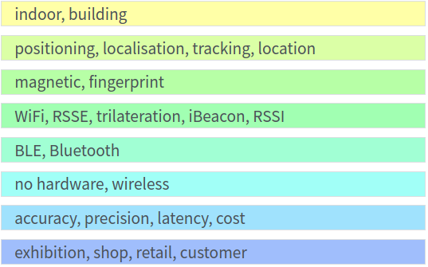

= Thesis proposal

ifdef::backend-html5[]
:twoinches: width='144'
:full-width: width='100%'
:half-width: width='50%'
:half-size:
:thumbnail: width='60'
endif::[]
ifdef::backend-pdf[]
:twoinches: pdfwidth='2in'
:full-width: pdfwidth='100vw'
:half-width: pdfwidth='50vw'
:half-size: pdfwidth='50%'
:40size: pdfwidth='40%'
:thumbnail: pdfwidth='20mm'
endif::[]
ifdef::backend-docbook5[]
:twoinches: width='50mm'
:full-width: scaledwidth='100%'
:half-width: scaledwidth='50%'
:half-size: width='50%'
:thumbnail: width='20mm'
endif::[]

:toc:

== Working topic
Indoor local positioning system for smartphones with infrastructure-free integration.

{toc}

//Please upload your thesis proposal here covering the following points:

// ====
// * A working topic that is succinct but indicative of the nature of the thesis project.
// * A background and problem statement that describes the subject matter in terms of its importance and potential for action. Describe the connection between research and innovation. Clarify the reasons for the choice of the thesis project topic.
// * A description of the purpose and definitions of the thesis project and outlines of a set of specific aims by which your work is intended to accomplish the objectives. State the hypotheses to be tested or technology to be developed.
// * A preliminary literature review/information retrieval that provides context and related literature for the thesis project.
// * A statement of the methodology for the thesis project that defines the specific design of the procedures, data collection, analysis, and (or) interpretation. Illustrate how the method you have chosen best allows you to fulfill the purpose of the thesis project.
// * A description of techniques to be used for the development of the thesis product, including specific software tools, programming languages, or other appropriate techniques.
// * A work plan that outlines the sequencing, flow, and timeline of the thesis project.
// * A statement of potential impacts on innovation, research, and education and their relationship to the problem being proposed.
// * A list of references.
// ====

=== Background and problem statement
// that describes the subject matter in terms of its importance and potential for action. Describe the connection between research and innovation. Clarify the reasons for the choice of the thesis project topic.
//
// The scope:: Development of software system for indoor location services applications, with system properties (price, accuracy, features) being optimized for specific chosen user case.

.Keywords used in patent search

// indoor localization system with no additional hardware - infrastructure-free

We all use positioning services: maps, navigation apps for cars. Positioning services require positioning technology to work with. The most well-known is a GPS, which can't work inside buildings. For indoor positioning services there exist some products, but there are huge drawbacks. The main problems are the price and complexity of the whole system.

* Two most popular technologies - WiFi and BLE - requires an additional hardware and cost too much for usual application.
* Other technologies (WiFI and magnetic field fingerprinting, image reconstruction and visible light) seems perspective, but complex in development, integration or / and usage.

Several companies and researchers are now developing the infrastructure free approaches. This means that the system works without any additional hardware installed "on-stage".
We define our system as infrastructure free, we use fingerprint database.

The problem:: There is no classical SLAM algorithm for fingerprints database collection.
Our proposal:: Framework for collecting database of fingerprints

State of the art approaches for fingerprints collection use neural networks, Bayesian and Kalman filtering, human step prediction and other complex techniques.

// Usually, there is a transmitter and receiver needed for communication and localization of people. On the human side, there is always a smartphone or any tracking device, sometimes only a passive mark such as RFID or NFC. On the facility side, there may be different complex architectures of equipment. Usually WiFi transmitters (office facilities), RFID antennas (in marketplaces), and other special devices. The alternative of having no additional equipment on the facilities side is the topic of this research.

// The infrastructure-free approach however is not stable, the final accuracy changes from many factors.
//The so-called level of readiness of technology is lower than competing technologies.

//Enhancements of smartphone-based magnetic fingerprinting and localization technique for infrastructure-free localization indoors.

.The reasons for the choice of the thesis project topic:
* it is possible to create and deliver a working system in less than one year
* all technologies on the market have a similar level of accuracy >> we focus on improving a system to be more universal and stable
// * we have researched the market for this technology and product
* we see the opportunity to create a startup and deliver services based on this technology
// after this product is done

=== Objectives
include::objectives.adoc[]

=== Literature review
//* A preliminary literature review/information retrieval that provides context and related literature for the thesis project.
include::literature-review.adoc[]

=== Methodology /  theoretical framework
//* A statement of the methodology for the thesis project that defines the specific design of the procedures, data collection, analysis, and (or) interpretation. Illustrate how the method you have chosen best allows you to fulfill the purpose of the thesis project.
include::methodology.adoc[]

=== Techniques
//* A description of techniques to be used for the development of the thesis product, including specific software tools, programming languages, or other appropriate techniques.
include::tech.adoc[]

=== Timeline
//* A work plan that outlines the sequencing, flow, and timeline of the thesis project.
include::project-plan.adoc[]

=== Innovation impact
//* A statement of potential impacts on innovation, research, and education and their relationship to the problem is proposed.
include::innovation-research.adoc[]

=== References
//* A list of references.
include::references.adoc[]

factor graphs lecture 12

noisy information wifi __>>> most accurate

define sensors, inout output